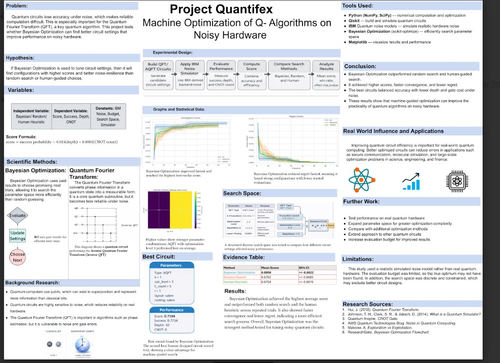

# Project Quantifex
**Machine Optimization of Quantum Algorithms on Noisy Hardware**

🥇 1st Place — WSSEF Science Fair 2026

---

Quantum computers are powerful in theory, but in practice, noise makes them unreliable. Every gate operation introduces small errors, and those errors compound quickly. The standard approach to dealing with this is manual tuning — researchers hand-pick circuit parameters based on intuition and experience. This project asks a simpler question: can a machine do that better?

Quantifex is a Bayesian Optimization framework that automatically searches for the best Quantum Fourier Transform (QFT) circuit configuration under realistic IBM hardware noise. It consistently outperformed both random search and human-guided tuning across every metric tested.



---

## The Problem

The Quantum Fourier Transform is a core subroutine in many quantum algorithms — Shor's algorithm, quantum phase estimation, and others. It works perfectly on paper, but on real NISQ-era hardware, noise degrades its output. The circuit has several knobs you can tune: whether to use an approximate version (AQFT), how aggressively to optimize the transpiler, how many times to repeat gate operations, and which layout and routing strategy to use.

The right combination of these parameters can meaningfully improve performance. The wrong combination makes things worse. Manually exploring this space is slow, inconsistent, and doesn't scale.

## The Approach

Rather than guessing, Quantifex treats parameter selection as a black-box optimization problem. A Gaussian Process model learns the relationship between circuit parameters and performance score from previous trials, then uses that model to decide where to search next. This is Bayesian Optimization — the same family of techniques used to tune hyperparameters in machine learning, applied here to quantum circuits.

Each circuit is evaluated against an IBM-derived noise model (pulled directly from `ibm_fez`) running on Qiskit Aer. The score balances output accuracy against hardware cost:

```
score = success_probability − 0.015 × depth − 0.0005 × CNOT_count
```

This rewards circuits that are not just accurate, but efficient — shorter depth and fewer two-qubit gates mean less exposure to noise.

## Results

Bayesian Optimization was benchmarked against random search and a human-designed baseline across 10 independent seeds with a fixed evaluation budget of 60 trials each.

| Method | Mean Score | 95% CI |
|---|---|---|
| Bayesian Optimization | **0.6950** | ±0.0022 |
| Random Search | 0.6752 | ±0.0085 |
| Human Heuristic | 0.6754 | ±0.0070 |

BO found stronger configurations faster, with lower regret throughout the search process. The best circuit discovered — an AQFT with `k=1`, `opt_level=3`, `t_count=5`, `r=1`, `layout=sabre`, `routing=sabre` — scored **0.7104**, compared to **0.662** for the best human-designed circuit.

The confidence intervals tell another part of the story. BO's narrow CI (±0.0022) means it consistently finds good solutions regardless of starting conditions. Random search and the human baseline are both wider and lower, meaning they're not just worse on average — they're less reliable.

## Running It Yourself

```bash
git clone https://github.com/zeeshatron-cpu/Project-Quantifex.git
cd Project-Quantifex
pip install -r requirements.txt
```

You'll need an IBM Quantum account to use the real noise model. Set your token as an environment variable before opening the notebook:

```bash
export IBM_QUANTUM_TOKEN="your_token_here"
jupyter notebook Quantifex_clean.ipynb
```

If you don't have an IBM account, set `USE_IBM_NOISE_MODEL = False` in the `CONFIG` dictionary at the top of the notebook. It'll fall back to a synthetic NISQ noise model and run fully offline. Results will differ slightly but the full pipeline works.

## Stack

- **Qiskit + Qiskit Aer** — circuit construction and noisy simulation
- **qiskit-ibm-runtime** — IBM backend access and noise model extraction
- **scikit-learn** — Gaussian Process Regressor with Matérn kernel
- **scikit-optimize** — Bayesian Optimization loop
- **NumPy / SciPy** — numerical computation and statistical testing (t-tests, effect size, 95% CI)
- **Matplotlib / pandas** — convergence curves, regret plots, parameter heatmaps, results tracking

## Limitations

The noise model used here is simulated from IBM hardware specs rather than sourced from live execution on a real device. The search space is also discrete and constrained, which means the true optimum may lie outside what was tested. Future work includes running validation on real quantum hardware, expanding to other algorithms like Grover's search and QPE, and relaxing the search space to allow continuous parameter values.

## References

- Hui, J. (2018). *Quantum Fourier Transform*
- Johnson, T.H., Clark, S.R., & Jaksch, D. (2014). *What is a Quantum Simulator?*
- Quantum Inspire. *CNOT Gate*
- AWS Quantum Technologies Blog. *Noise in Quantum Computing*
- Makone, A. *Exploration vs Exploitation*
